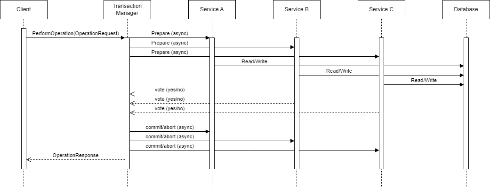

# 2PC-TM-POC

Take Home Assignment for Parametric Research

## Prerequisites

This project requires Go version 1.18 to run the server. If you want to recompile the `transaction.proto` file, then you will also need the `protoc` compiler.

## Usage

To build the project use the command:

```bash
$ go mod download
$ make build
```

To run it, an executable called `2pc-tm-poc.exe` should have been created after building. Run it with:

```bash
$ ./2pc-tm-poc.exe
```

## System Description

This system models a Transaction Manager (TM) for a distributed system that implements the two-phase commit (2PC) protocol to coordinate stateful changes between services with interdependencies. The TM server is a gRCP server that currently has a single service to test the correctness of the 2PC implementation.

### Components

- Transaction Manager (TM):

- Services:

- Database:

- Client:

### Handling Transactions

General Flow of Service Calls and Messages



The actions performed on the database by the services (A, B, and C) after receiving a commit/abort message from the TM

#### Success Scenarios

All services vote `yes`: TODO

#### Failure Scenarios

At least one service votes `no`: TODO

## Technical Debt and Future Work

Hard to determine without a deeper understanding of the current implementation and architecture being used. However, the 2PC protocol is very simple, and should be easy to implement.

### Why use 2PC?

TODO

### Drawbacks of 2PC

TODO
