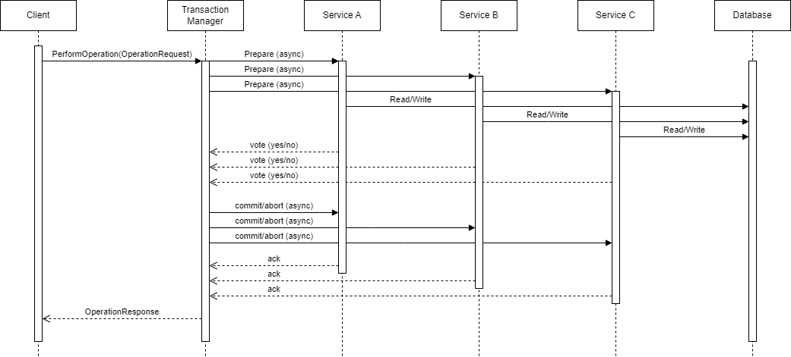

# 2PC-TM-POC

Take Home Assignment for Parametric Research

## Prerequisites

This project requires Go version 1.18 to run the server. If you want to recompile the `transaction.proto` file, then you will also need the `protoc` compiler.

## Usage

To build the project use the command:

```bash
$ go mod download
$ make build
```

To run it, an executable called `2pc-tm-poc.exe` should have been created after building. Run it with:

```bash
$ ./2pc-tm-poc.exe
```

## System Description

This system models a Transaction Manager (TM) for a distributed system that implements the two-phase commit (2PC) protocol to coordinate stateful changes between participants with interdependencies.

### Components

- Transaction Manager (TM): TODO

- Participants: TODO

- Database: TODO

- Client: TODO

### Handling Transactions

**General Flow of Service Calls and Messages**



Steps:

1. Request received.
2. Phase 1: Process request and message all participants to prepare.
3. Wait for votes: All participants should return a `yes` or `no`.
4. Phase 2: Message participants to commit or abort their operation depending on their votes.
5. Wait for acknowledgement and return response.

_The actions performed on the database by the participants (services A, B, and C) after receiving a commit/abort message from the TM are ommited as they would crowd the diagram. It should be similar to the earlier calls to the database._

#### Success Scenarios

All participants vote `yes`: If all participants return a vote of `yes`, the TM will proceed with messaging all participants to `commit`. Once an acknowledgement is received from all participants, return the success response.

#### Failure Scenarios

At least one participant votes `no`: If one or more of the participants returns a vote of `no`, the TM will proceed with messaging all participants to `abort`. Once an acknowledgement is recieved from all participants, return the failure response.

## Testing and Verification

In order to test the correctness of the system, the PerformOperation procedure can be called, passing it a string of 3 bits (eg. "010", "111", "100", etc). The first character represents the outcome for service A, the second character for service B and the third for service C. A one indicates that the service will succed, whereas a 0 indicates that the service will fail.

    Example inputs and expected response:

    "010" --> fail: service A votes `no`, service B votes `yes`, service C votes `no`
    "111" --> success: service A votes `yes`, service B votes `yes`, service C votes `yes`

Now it is easy to see that given a request of "111" is the only success scenario (ie. all participants vote `yes`). In testing the system, all valid inputs were tested and a successful response was returned only for the "111" case, validating that the system functions correctly.

## Technical Debt and Future Work

This is hard to determine without a deeper understanding of the current implementation and architecture being used. However, the 2PC protocol is very simple, and should be easy to implement.

### Why use 2PC?

TODO

### Drawbacks of 2PC

TODO
